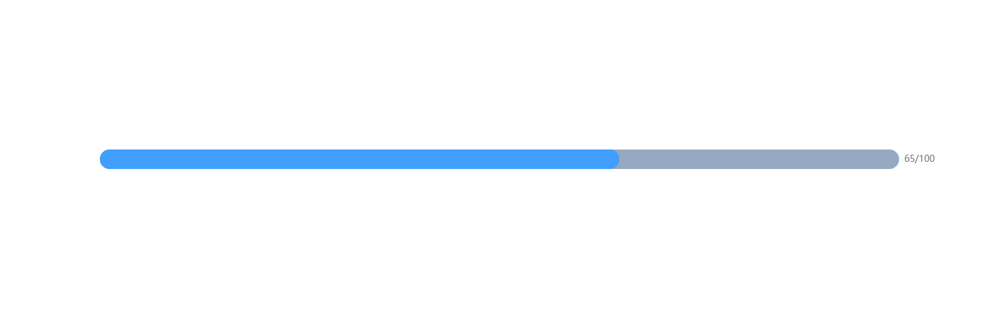
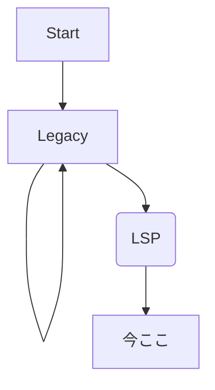
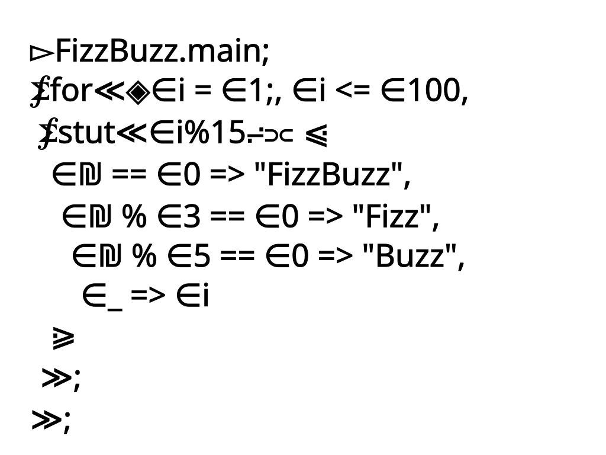

<h1 align=center>Argon Programming Language Project</h1> 

<h3 align=right>メンバー ありひろ</h3>
## このプロジェクトは・・・

Argonという新しいありひろ好みなプログラミング言語を作る.
今回はその規格やマニュアルを作る.

<h2 align=right>動機</h2>

これまでいろいろなプログラミング言語に触れてきて、しっくりくるものがなかった. 
また、ビジネスで使うことを前提にしたものや、機能性だけを追求して意味が分からないものが多かった.（またはその両方） 
自分が理想としているプログラミング言語は、 <h3 align=center>「シンプルさ」 「言語自体の柔軟性」　「きれいさ」</h3>

 + <strong>実用的</strong> 
を極限まで追求したものだった. 
ただ、そういうような言語をGoogleさんに聞いても答えを得ることはできなかった.

 
 
 
<h4>そこで自分は考えた...</h4>
<h1 align=center>\\だったら作ればいいじゃない//</h1>

ということで、作ります.

<h2 align=center>進捗</h2>

<h2 align=center>これまで</h2>

##### 1. まず、自分の好きなようにキラキラさせてみた. ここまでがLegacy版

ただ、これだと拡張性がない...
もっと頭がいい人のを参考しようとする.

<h6 align=center>ここまでが2~3週間前</h6>

##### 2. Lispに出会う

https://qiita.com/keke21/items/a13a28a9295e44f6144b
で、LispのS字式に出会う.
きれいだと思ったので、これをメインにして設計することにした.
今のマニュアルは、右についてるんで読んでください.